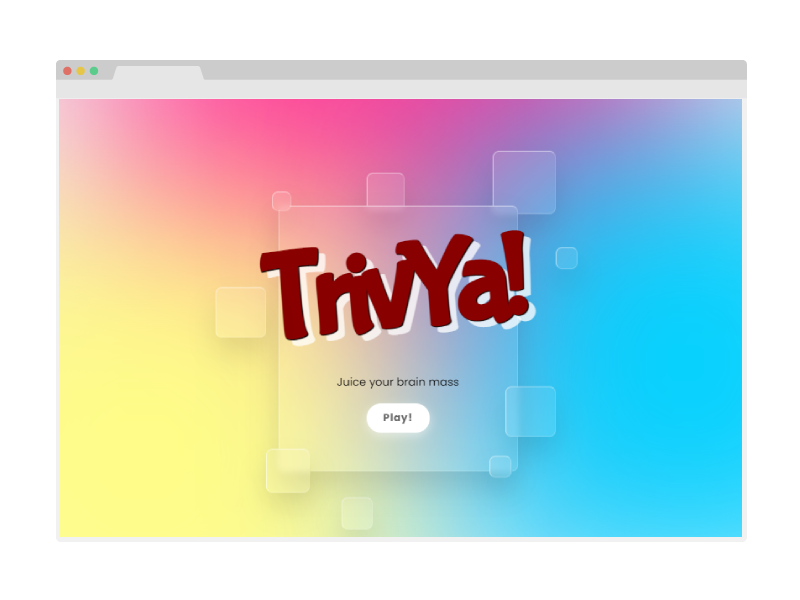

<div id="top"></div>

<!-- PROJECT LOGO -->
<br />
<div align="center">
  <a href="https://github.com/lopezrunco/TrivYa">
    
  </a>

<h3 align="center">TrivYa</h3>
  <p align="center">
    Trivia game in glassmorphist style
  </p>
    <a href="https://trivya-407af.web.app/">View Demo</a>
  <br />
  <br />
  <br />
</div>


<!-- TABLE OF CONTENTS -->
<details>
  <summary>Table of Contents</summary>
  <ol>
    <li>
      <a href="#about-the-project">About The Project</a>
      <ul>
        <li><a href="#built-with">Built With</a></li>
      </ul>
    </li>
    <li>
      <a href="#getting-started">Getting Started</a>
    </li>
  </ol>
</details>


<!-- ABOUT THE PROJECT -->
## About The Project



This game was build in HTML, CSS and Vanilla JavaScript in order to learn the basics of JavaScript and take my CSS skills to explore glassmorphism styles.

<p align="right">(<a href="#top">back to top</a>)</p>


### Built With

* HTML
* CSS
* Javascript
* Firebase

<p align="right">(<a href="#top">back to top</a>)</p>


<!-- GETTING STARTED -->
## Getting Started

1. Clone the repo
   ```sh
   git clone https://github.com/lopezrunco/TrivYa.git
   ```
2. Run the index.html file in the browser
3. To edit or add more questions, edit the app.js file
   ```js
   const quizData = [
    "category": "Web development",
    "quiz": "Wich language runs in a web browser?",
    "answer": "JavaScript",
    "wrongAnswer1": "Java",
    "wrongAnswer2": "C",
    "wrongAnswer3": "Python",
    "image": "https://images.unsplash.com/filesrc",
    "objectFit": "cover"
   ]
   ```

<p align="right">(<a href="#top">back to top</a>)</p>
